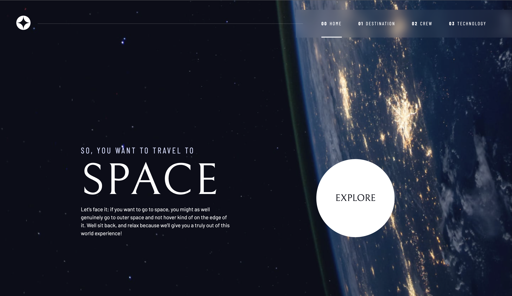
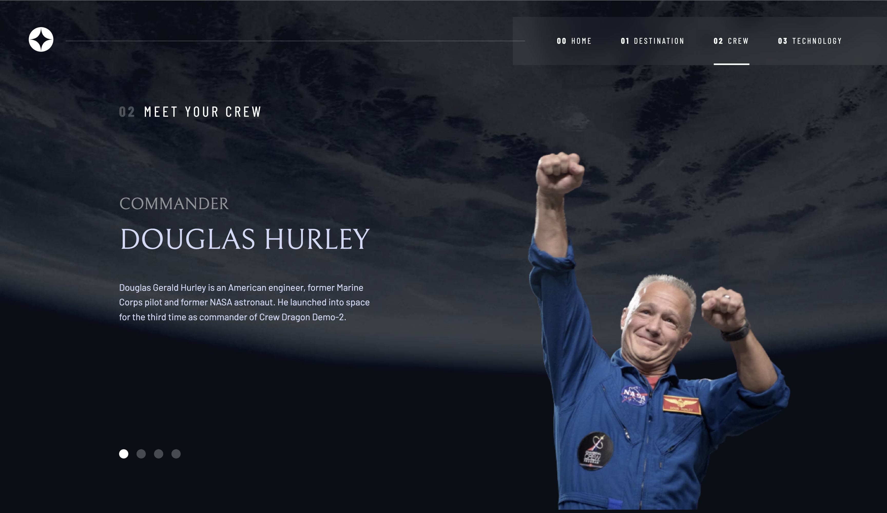
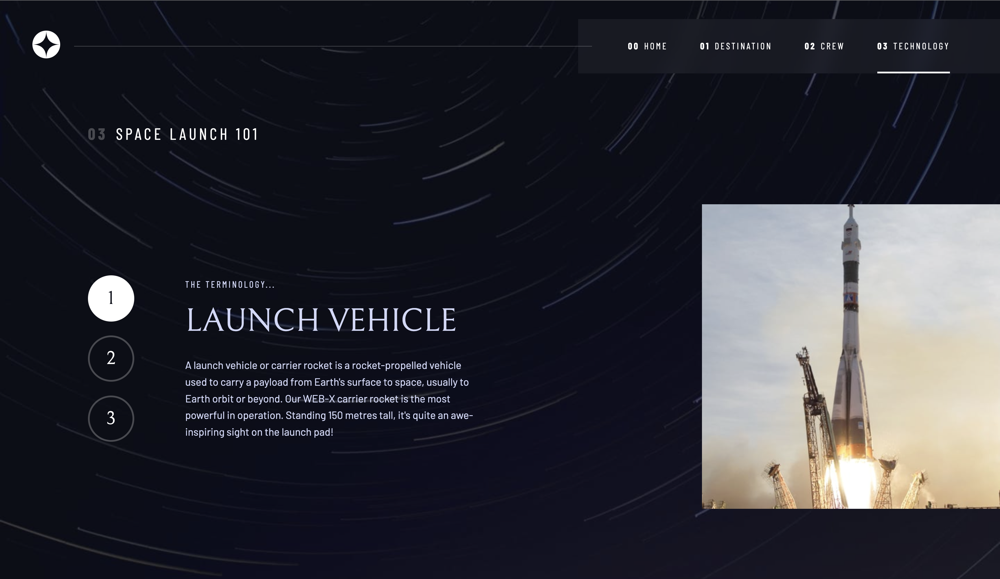

# Frontend Mentor - Space tourism website solution

This is a solution to the [Space tourism website challenge on Frontend Mentor](https://www.frontendmentor.io/challenges/space-tourism-multipage-website-gRWj1URZ3). Frontend Mentor challenges help you improve your coding skills by building realistic projects. 

## Table of contents

- [Overview](#overview)
  - [The challenge](#the-challenge)
  - [Screenshot](#screenshot)
  - [Links](#links)
- [My process](#my-process)
  - [Built with](#built-with)
  - [What I learned](#what-i-learned)
  - [Continued development](#continued-development)
  - [Useful resources](#useful-resources)
- [Author](#author)
- [Acknowledgments](#acknowledgments)


## Overview

### The challenge

Users should be able to:

- View the optimal layout for each of the website's pages depending on their device's screen size
- See hover states for all interactive elements on the page
- View each page and be able to toggle between the tabs to see new information

### Screenshot







### Links

- Solution URL: [https://www.frontendmentor.io/solutions/responsive-space-tourism-website-with-css-grid-QSasHMl3Pd](https://www.frontendmentor.io/solutions/responsive-space-tourism-website-with-css-grid-QSasHMl3Pd)
- Live Site URL: [https://carolsemeao.github.io/space-tourism-website/](https://carolsemeao.github.io/space-tourism-website/)

## My process

### Built with

- Semantic HTML5 markup
- CSS custom properties
- Flexbox
- CSS Grid
- Mobile-first workflow


### What I learned

Thanks to Kevin Powell's Scrimba lesson, I learned how to use CSS grid much better and also how to use utility classes. This made my coding progress much easier.

```css
/* typography */
.ff-serif { font-family: var(--ff-serif); }
.ff-sans-cond { font-family: var(--ff-sans-cond); }
.ff-sans-normal { font-family: var(--ff-sans-normal); }
```
```js
function hideContent(parent, content) {
    parent
        .querySelectorAll(content)
        .forEach((item) => item.setAttribute("hidden", true));
}

function showContent(parent, content) {
    parent.querySelector([content]).removeAttribute('hidden');
}
```

### Continued development

For continued development I want to focus on fixing the content that keeps jumping on tab change and the picture sizes on the technology page. It gets too small very quickly. What I think would also be cool, would be trying to implement the data.json file instead of copying the code many times

### Useful resources

- [Kevin Powell's Scrimba lesson](https://scrimba.com/learn/spacetravel) - This interactive lesson from Kevin helped me a lot while building this website. Using utility classes and the addition of accessibility was amazing and was very well explained

## Author
- Github - [@carolsemeao](https://github.com/carolsemeao)
- Frontend Mentor - [@carolsemeao](https://www.frontendmentor.io/profile/carolsemeao)


## Acknowledgments

If I could give someone a tip for this challenge it would be, to have some CSS Grid and Flexbox experience and of course to use utility classes. It takes some time to set them up, but you'll be so happy to have done that. They will help you write much less code.

Also shoutout to Kevin Powell for this amazing collaboration with Frontend Mentor. Please give him a follow on Youtube
- Kevin Powell's YT Channel - [https://www.youtube.com/kevinpowell](https://www.youtube.com/kevinpowell)
